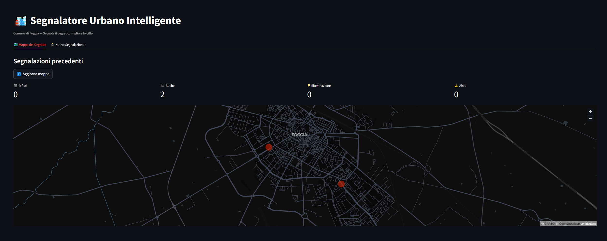

# 🏙️ Segnalatore Urbano Intelligente — Foggia

<p align="center">
  <b>La tua voce per una Foggia migliore.</b><br/>
  Scatta, analizza, segnala. In meno di un minuto.
</p>

<p align="center">
  <a href="https://github.com/cascioli/segnalatore-urbano-ai/stargazers">
    
  </a>
  <a href="https://github.com/cascioli/segnalatore-urbano-ai/blob/main/LICENSE">
    
  </a>
  
  
  <a href="https://segnalafoggia.streamlit.app">
    
  </a>
</p>

<p align="center">
  <!-- PLACEHOLDER: sostituisci con screenshot o GIF dell'app -->
  
</p>

---

## ✨ Cos'è

**Segnalatore Urbano Intelligente** è un'app web open source pensata per i cittadini di Foggia. Permette di segnalare problemi nella città — buche, rifiuti abbandonati, lampioni rotti — direttamente agli uffici comunali competenti, con l'aiuto dell'intelligenza artificiale.

Basta caricare una foto. Il resto lo fa l'app:

- 🤖 **Gemini AI** analizza il problema e scrive la descrizione
- 📍 **GPS automatico** o geocoding dell'indirizzo inserito
- 📧 **Email precompilata** al corretto ufficio del Comune
- 🗺️ **Mappa pubblica** con tutte le segnalazioni dei cittadini

---

## 🚀 Funzionalità

| Feature | Descrizione |
|---|---|
| 📸 Analisi AI multimodale | Fino a 3 foto analizzate da Gemini 2.5 Flash (fallback su 2.5 Flash Lite) |
| 🗂️ Categorizzazione automatica | Buche, Rifiuti, Illuminazione/Reti, Altro |
| 📍 GPS da EXIF | Coordinate estratte automaticamente dalla foto |
| 🗺️ Geocoding fallback | Se il GPS manca, l'indirizzo viene convertito in coordinate via Nominatim (OSM) |
| 📧 Email routing smart | L'email viene indirizzata all'ufficio comunale corretto in base alla categoria |
| ⚡ Domanda di follow-up AI | Gemini genera una domanda contestuale per arricchire la segnalazione |
| 🌍 Mappa pubblica | Tutte le segnalazioni geolocalizzate visibili a tutti |
| 🔒 Anonimato garantito | Nessun dato personale raccolto |

---

## 🛠️ Stack tecnologico

| Componente | Tecnologia |
|---|---|
| Frontend & logica | Python 3.10+, Streamlit |
| Intelligenza visiva | Google Gemini 2.5 Flash + 2.5 Flash Lite (fallback automatico, `google-genai`) |
| Database & mappa | Supabase (PostgreSQL) |
| Geocoding | Nominatim / OpenStreetMap (gratuito, no API key) |
| Estrazione GPS | `exifread`, `Pillow` |
| Test | `pytest` |
| Hosting | Streamlit Community Cloud |

---

## ⚙️ Come funziona

```
[Cittadino carica foto]
        │
        ▼
[Estrazione GPS da EXIF] ──── nessun GPS ────► [Geocoding indirizzo via Nominatim]
        │
        ▼
[Gemini AI analizza le foto]
        │
        ├── categoria: Buche       → lavori.pubblici@comune.foggia.it
        ├── categoria: Rifiuti     → ambiente@comune.foggia.it + cc AMIU
        ├── categoria: Illuminazione → urbanistica@comune.foggia.it
        └── categoria: Altro       → urp@comune.foggia.it
        │
        ▼
[Email precompilata pronta] + [Punto salvato sulla mappa pubblica]
```

---

## 💻 Sviluppo locale

### Prerequisiti

- Python 3.10+
- Un progetto [Supabase](https://supabase.com) con la tabella `segnalazioni` (vedi sotto)
- Una API key [Google AI Studio](https://aistudio.google.com)

### Installazione

```bash
git clone https://github.com/cascioli/segnalatore-urbano-ai.git
cd segnalatore-urbano-ai

python -m venv .venv
# Windows:
.venv\Scripts\activate
# macOS/Linux:
source .venv/bin/activate

pip install -r requirements.txt
```

### Configurazione secrets

Crea il file `.streamlit/secrets.toml` (non committare mai questo file — è già in `.gitignore`):

```toml
GEMINI_API_KEY = "la-tua-api-key"
SUPABASE_URL   = "https://xxxx.supabase.co"
SUPABASE_KEY   = "eyJ..."
```

### Avvio

```bash
streamlit run app.py
```

Apri [http://localhost:8501](http://localhost:8501) nel browser.

---

## 🗄️ Schema database Supabase

Esegui questo SQL nell'editor di Supabase (`SQL Editor → New query`):

```sql
-- Se aggiorni una tabella esistente (aggiunge colonne mancanti):
alter table segnalazioni
  add column if not exists image_url text,
  add column if not exists resolved  boolean not null default false;

-- Backfill se resolved è NULL su righe vecchie:
update segnalazioni set resolved = false where resolved is null;

-- Schema completo (creazione da zero):
create table segnalazioni (
  id         uuid primary key default gen_random_uuid(),
  lat        float8,
  lon        float8,
  categoria  text not null,
  image_url  text,
  resolved   boolean not null default false,
  created_at timestamptz default now()
);
```

Poi applica le policy RLS eseguendo `supabase/migrations/002_rls_policies.sql` nell'editor SQL di Supabase (o incollane il contenuto direttamente).

Le policy definite:

| Policy | Operazione | Regola |
|--------|-----------|--------|
| `public_read` | SELECT | Tutti possono leggere |
| `public_insert` | INSERT | Solo coords Foggia + categoria valida |
| `public_resolve` | UPDATE | Solo `resolved false → true` |
| `no_delete` | DELETE | Bloccato esplicitamente |

---

## 🤝 Come contribuire

Contributi benvenuti! Ecco come partecipare:

1. **Forka** il repository
2. Crea un branch: `git checkout -b feat/nome-feature`
3. Fai le tue modifiche e committa: `git commit -m "feat: descrizione"`
4. Pusha il branch: `git push origin feat/nome-feature`
5. Apri una **Pull Request** su GitHub

### Idee per contribuire

- 🌍 Adattare l'app ad altri Comuni italiani (routing email configurabile)
- 📊 Dashboard admin per il Comune con statistiche sulle segnalazioni
- 🔔 Notifiche email di conferma al cittadino
- 🗺️ Mappa interattiva con cluster e filtri per categoria
- 🌐 Supporto multilingua (IT/EN)

### Bug report

Apri una [Issue su GitHub](https://github.com/cascioli/segnalatore-urbano-ai/issues) con:

- Descrizione del problema
- Passi per riprodurlo
- Screenshot (se utile)

---

## 📄 Licenza

Distribuito sotto licenza **GNU Affero General Public License v3.0** (AGPL-3.0-or-later). Vedi [`LICENSE`](LICENSE) per i dettagli.

L'AGPL garantisce libertà di uso, modifica e distribuzione — anche in modalità SaaS/network — a condizione che il codice sorgente rimanga sempre accessibile agli utenti finali.

### Licenza commerciale

Se vuoi usare questo software a scopo commerciale **senza l'obbligo di rendere pubblico il codice sorgente**, è disponibile una licenza commerciale su richiesta.

### Supporto professionale

Sono disponibile per:

- **Assistenza e gestione professionale** dell'applicazione
- **Adattamento** ad altri Comuni o contesti specifici
- **Sviluppo di funzionalità personalizzate**

Per licenze commerciali o supporto professionale contatta: [rent.dev.commercial@gmail.com](mailto:rent.dev.commercial@gmail.com)

---

## 👤 Autore

**Simone Cascioli**
🌐 [simonecascioli.it](https://simonecascioli.it) · 🐙 [@cascioli](https://github.com/cascioli)

---

<p align="center">
  Fatto con ❤️ per Foggia
</p>
